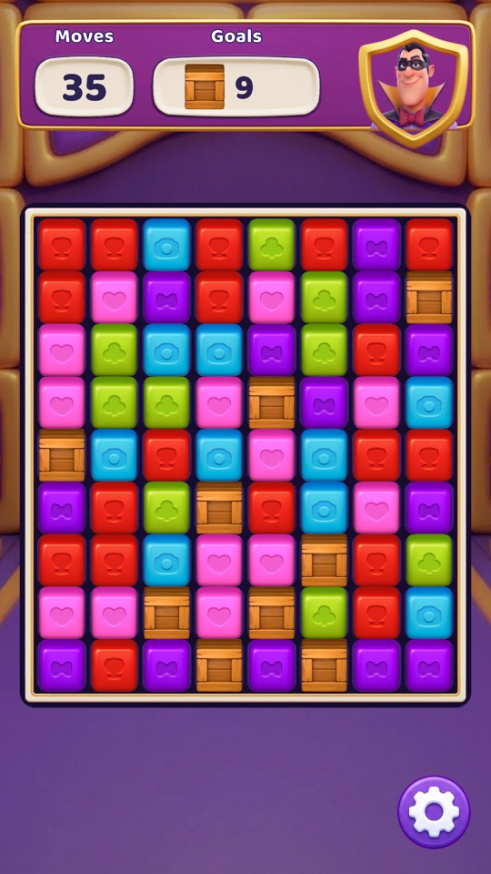
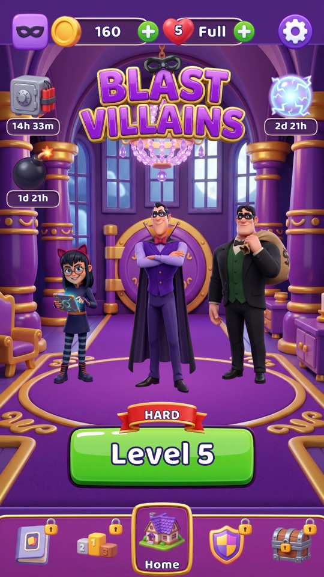
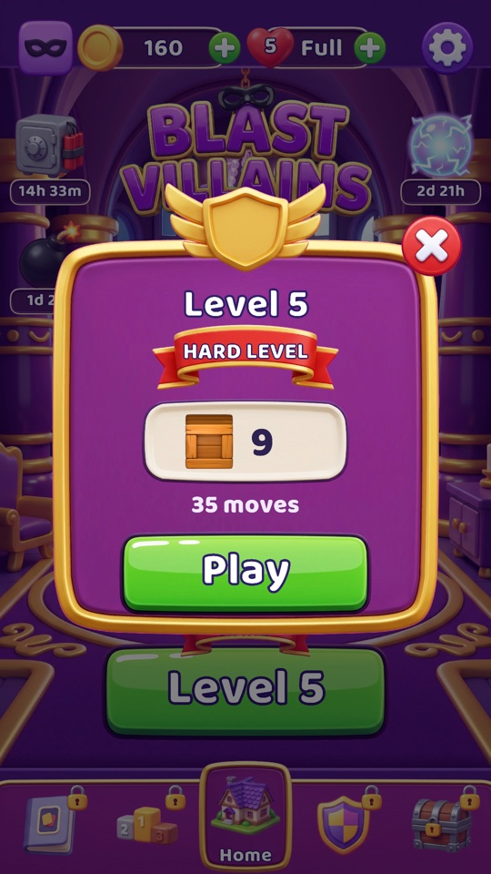
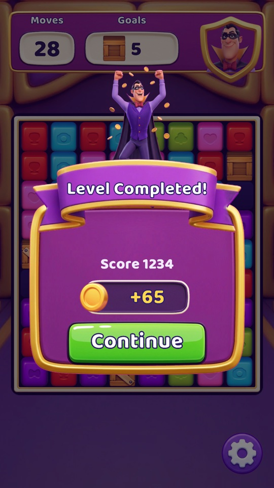

# Blast Villains

A collapse / tile-matching game built for the Good Job Games case study, in **Unity 6000.2.6f2**.
Tap any group of two or more adjacent same-coloured blocks to blast it; blocks above fall in and new
ones drop from the top. Break every Box before the moves run out. A board this game generates can
never reach a state with no legal move — that is a property of the code, held by a test rather than
by an argument.

The case names performance — memory, CPU, GPU — as its focus, so that is what the architecture is
organised around. The short version: **the game rules never touch the engine, and nothing on the
board allocates after it is built.**

<p align="center">
  
</p>

---

## v2 — presentation update

The case was submitted as a single board screen; that version is tagged **`case-submission`**. v2
dresses it as a small live game, modelled on the look and screen flow of Good Job Games' *Match
Villains*.

| Home | Level briefing | Win |
|:---:|:---:|:---:|
|  |  |  |

**What changed**

- Two scenes, **Home** and **Level**, joined by a fade. A persistent `App` object carries the
  transition and the audio across them.
- A **twelve-level campaign** with coins and saved progress, tuned against a bot to a measured
  pass-rate curve.
- The level runs as an **explicit state machine**: briefing, intro, play, pause, confirm-exit,
  settling, won, lost.
- Generated art (backgrounds, characters, UI, board frame), particles, sound effects and music.
- Feel: blocks rain in at the start, rejected taps wiggle, broken Boxes fly to the goal counter,
  combo callouts, a hint after five idle seconds, a low-moves warning.

**What did not change**

- `Core` — the rules, the data model and the algorithms — is the same code with the same tests, plus
  three small additions (`BoardConfig.BoxCapacity`, `BoxesToPlace`, `TierFor`, and
  `Board.GroupIdAt`) that let the view ask Core instead of restating its rules.
- The board still animates through its own preallocated animators, not a tween library.

**Thresholds from v1 that v2 crossed.** v1's [scope section](#scope-and-future-work) named the point
at which each left-out piece would start paying for itself. Three of those points arrived:

| v1 said | Threshold | What v2 did |
|---|---|---|
| Explicit state machine | "the second screen" | `LevelFlow` with one class per state |
| Progression, save/load | "progression across levels" | `LevelCatalog`, `PlayerProgress`, a JSON save with a backup swap |
| A tweening library | "a second mechanism whose only advantage is convenience" | PrimeTween — for UI and meta only; the board keeps its own animators |

---

## The rules, as implemented

| Rule | Where |
|---|---|
| 2+ orthogonally adjacent same-colour blocks form a blastable group | `GroupFinder.cs` |
| K colours (1–6), M rows and N columns (2–10) | `BoardConfig.cs`, `LevelConfig.cs` |
| Icon tiers: group size `> C` → 3rd icon, `> B` → 2nd, `> A` → 1st, else default | `BoardConfig.TierFor` |
| Emptied cells refill from above and from blocks spawned off the top of the column | `GravityResolver.cs` |
| Box obstacle: ignores gravity, blocks the fall of everything above it, 2 health, takes **one** damage per adjacent group — not per block | `Board.cs`, `Cell.cs` |
| Settled blocks stay tappable while others are still falling | `BoardView.TryPickCell` |
| Deadlock is detected and resolved without a blind reshuffle, and the resolution cannot fail on a board this game can generate | `DeadlockResolver.cs` |
| Win when no Box is left, lose when the moves run out — win is checked first | `GameSession.Play` |

---

## Architecture

```
Assets/Scripts/
├── Core/            Pure C# game rules. No UnityEngine, enforced by the compiler.
│                    Board, Cell, Grid, BoardConfig, GroupFinder, GravityResolver,
│                    DeadlockResolver, BlastResult, GameSession
└── Game/            The Unity shell.
    ├── App/         App, SceneTransition, PlayerProgress, SaveSystem, SaveData
    ├── Audio/       AudioService, SoundBank
    ├── Board/       BoardView, BoardHint, BoardDecor, BoardCamera, BlockView, BlockPool,
    │                LevelBackground
    ├── Effects/     FallAnimator, EffectRunner, Vfx, Easing
    ├── Flow/        LevelFlow, LevelState and its eight States/, LevelCatalog, LevelRequest
    ├── Home/        HomeView, CoinCounter, LockedFeature, Toast, EventTimer
    ├── UI/          HudView, FeedbackView, IntroBanner, SafeArea, Popup and its Popups/
    └── GameController, InputHandler, LevelConfig
Assets/Tests/EditMode/   65 test cases over Core, engine-free
```

How the pieces fit — a tap end to end, the scene flow and the state machine — is drawn out in
[`ARCHITECTURE.md`](ARCHITECTURE.md).

### 1. Core cannot reference the engine

`BlastGame.Core.asmdef` is marked **No Engine References**. Writing `using UnityEngine` in `Core`
does not fail review — it fails to compile. `UnityEngine.Random` is unreachable for the same reason,
so randomness is injected as a `System.Random` and every board is reproducible from a seed.

This is what makes the tests engine-free: they assert on rules, not on a scene.

### 2. The rules resolve instantly; animation trails behind

`Board.TryBlast()` produces the final board in one call — removals, Box damage, falls, spawns,
regrouping. The board is never observable in a half-resolved state. The view then walks blocks from
where they were drawn to where the board says they now are, and that animation is **purely
cosmetic**: it cannot change an outcome, and dropping a frame of it loses a sparkle, never a move.

One consequence is deliberate: *"is this block still in the air?"* lives in the view
(`FallAnimator.IsSettled`), never in Core. Core has no notion of time. The same split shows up at the
end of a level: Core says "won" the instant the last move resolves, and the level's `SettlingState`
waits for the board to land before the end card appears.

### 3. Restraint as a design goal

No event bus, no DI container, no command pattern, no interfaces with a single implementation, no
LINQ. v2 added a state machine and a save system because the thresholds for them arrived, and
nothing else. [Scope and future work](#scope-and-future-work) records what a production version
would add — and, more usefully, the **threshold** at which each one starts paying for itself.

---

## Performance

The mechanisms, not the intention:

### Memory

- `GroupFinder` keeps its `groupIdOf`, `groupSizes` and DFS `stack` as fields, allocated once. The
  search is iterative, and cells are marked **when pushed** rather than when popped, which bounds the
  stack at exactly `M*N`.
- `FallAnimator` and `EffectRunner` are struct arrays with a live count, walked by one `Tick`.
  Finishing an entry swaps the last one into its slot, so the loop runs backwards and nothing is
  skipped or done twice.
- `BlockPool` creates every block once and then only activates and deactivates. `Rent` **throws**
  rather than growing: capacity is derived from the board, so running out means the view leaked a
  block. Effects use `TryRent` on a pool of their own and simply drop an effect when it is empty.
- `Board.TryBlast` writes into one reused `BlastResult`. It is valid during the call and never stored.
- Labels are written with `label.SetText("{0:0}", value)`, not an interpolated string, so a changing
  number puts nothing on the heap.
- PrimeTween is given its capacity up front (`App`), and every callback uses the target overload, so
  no tween captures a closure.
- `AudioService` owns a fixed set of `AudioSource`s; playing a sound picks one, it never creates one.
- `Vfx` emits from one `ParticleSystem` per kind with a struct `EmitParams` — no instance per burst,
  no pool, nothing to return.

### Draw calls

- Every sprite on the board — blocks, Boxes, cell tiles, the frame, the mask and blast shards — is in
  `BlockAtlas`, on one material. Shards are pooled `SpriteRenderer`s rather than particles for exactly
  that reason: a particle system draws with its own material and would split the board's batch.
- The particles that do exist (sparkles, glows, splinters, dust, confetti) all share **one** material,
  `Vfx.mat`, with a premultiplied-alpha shader, so they batch with each other.
- UI sprites are in `UiAtlas`. The HUD, the score and combo callouts, the popups and the scene fade sit
  on separate canvases, so text that fades every frame rebuilds its own canvas and not the HUD's.
  Non-interactive graphics have `raycastTarget` off.

### CPU

Input is grid arithmetic — `ScreenToWorldPoint` and a floor division. No colliders, no physics, no
raycast. The whole board has **one** `Update`; no block has one of its own.

### What was measured

A short pass over v2, with a bot tapping every twelve frames. Draw calls come from the editor's
Stats counters. Allocations come from a macOS development build, compared against the same scene
with the game switched off, so the test runner's own overhead is excluded.

| | Home | Level, idle | Level, playing | Level, end card |
|---|---|---|---|---|
| Batches | 9 | 14–15 | 16–18 | up to 23 |
| SetPass calls | 3 | 11–12 | 13–14 | up to 18 |
| GC per frame | 0 B, one ~7 KB frame | 0 B | 0 B in most frames, a few KB now and then | a one-off spike |

- **The draw calls do not grow with the board.** A 2×2 level and a 10×10 level both idle at 14–15
  batches; on the 10×10, batching saves about 200 draw calls. The board alone is **5 batches**,
  against 1 in v1, and the rest comes from the background, the particles and the HUD.
- **A move allocates nothing.** Across 98 moves, `TryBlastAt` and everything it triggers
  synchronously allocated 0 B.
- **The occasional allocations are one-off costs, not per-frame work.** Some frames right after a
  move allocate a few KB, and the level's end allocates once. A short profiler capture put the
  end-of-level cost on TextMeshPro growing its text buffers, popups enabled for the first time, and
  the win.

v1 (`case-submission`) measured 0 B during play and drew the board as a single batch. v2's extra
batches come from the new layers: a full-screen background, particles and a much richer UI.

Also verified: the engine-free boundary, by the compiler, and 65 test cases across 6 fixtures covering
group finding and adjacency, icon tiers, gravity segmentation and Box damage, blast ordering, deadlock
detection, shuffle guarantees, that generation never produces a board with no legal move, and that
the goal shown before a level matches the Boxes it places.

---

## Presentation

- **Board:** the block and Box sprites supplied with the case, over a checkerboard of cell tiles and
  under a generated ornate frame. A `SpriteMask` clips the board, so new blocks appear from behind the
  frame rather than in mid-air above it.
- **Art:** backgrounds, characters, UI panels, buttons, icons and the logo were generated with AI image
  tools (Nano Banana) and processed into sprites by `ArtProcessor` — keying, sheet cutting, trimming.
  The raw images live in `ArtSource/`, outside `Assets/`, so Unity never imports them.
- **Motion:**
  - Blocks fall under gravity (`sqrt(2d/g)`), not at a constant rate, and squash on landing without
    becoming untappable for even a frame.
  - A blasted block swells past its cell and collapses, throwing shards of its own sprite. Effects past
    a fixed cap are dropped rather than queued: a full board blasting at once would otherwise ask for
    hundreds.
  - A hit Box rocks and splinters; a broken one knocks the camera and flies to the goal counter, which
    counts down when it lands rather than when Core removed it.
  - A deadlock shuffle shrinks every block away, swaps the colours while nothing is on screen, and
    grows them back.
- **Chapters:** the level background changes every four levels — vault, museum, rooftop.
- **Sound:** CC0 sound effects and music (`Assets/Audio/LICENSES.md`). One event is one sound: each
  entry in the `SoundBank` has a voice limit and a cooldown, so forty blocks landing together are one
  thud. Music crossfades between scenes and dips under jingles. Every button clicks without being
  wired to a sound.
- **Screen:** portrait only, 60 fps, laid out inside the device's safe area. The board is fitted into
  an invisible `BoardArea` rectangle in the HUD, so moving that rectangle in the UI moves the board.
- **Home screen:** a mock-up of a live game's home. Buttons for features this build does not have
  wiggle and say at which level they unlock, so nothing on the screen is a dead tap.

---

## Third party

| What | Licence | Why |
|---|---|---|
| [PrimeTween](https://github.com/KyryloKuzyk/PrimeTween) 1.3.3 | PrimeTween licence; installed as a UPM package from OpenUPM, as it requires | UI and meta animation with no per-tween allocation |
| TextMeshPro (ships in `com.unity.ugui`) | Unity | SDF text stays sharp at any size |
| [Baloo 2](https://fonts.google.com/specimen/Baloo+2) ExtraBold | OFL (`Assets/Fonts/`) | Typeface |
| Kenney sound packs, MintoDog music | CC0 (`Assets/Audio/LICENSES.md`) | Sound effects and the two music loops |

**Why PrimeTween, and why only for UI.** v1 had no tween library: the board already needed a
preallocated, single-`Tick` animator, and a second mechanism only for convenience was a dependency
without a reason. v2 added popups, flying coins, banners and punches — dozens of one-off UI motions —
and that is the point at which a tween library pays. The board kept its own animators, so the hot path
did not change.

The font asset is generated by `PolishSetup.CreateFontAsset` and is **static**: its 95 printable ASCII
glyphs are baked in, because a dynamic font asset renders missing glyphs during play — which
allocates. The first non-ASCII localisation needs a different font strategy.

---

## Running it

1. Open the project in Unity **6000.2.6f2**.
2. Open `Assets/Scenes/Home.unity` and press Play.

`Level.unity` also plays on its own: with no request from the home screen it plays the **debug
level** set on its `Game` object, and winning it does not touch the saved campaign.
**Tools → Blast → Reset Progress** returns the campaign to Level 1 with no coins.

A level is a `LevelConfig` asset — rows, columns, colour count, the three icon thresholds, Box count,
move limit, seed and a "Hard" label — so **a new level is a new asset, not new code**. A seed of `0`
means a fresh board every run; any other value reproduces the same board exactly.

### The campaign

Twelve levels in `Assets/Levels/Campaign/`, ordered by `LevelCatalog`. Past the last one the final
four repeat, so the demo never runs out. Difficulty is a sawtooth — it climbs, peaks on a Hard level,
then relaxes — and the numbers are measured rather than guessed: a bot that plays at the Boxes, with
one move in five random, played each row a few thousand times.

| Level | Board | Colours | Boxes | Moves | Measured pass rate |
|---:|:---:|:---:|---:|---:|---:|
| 1 | 7×7 | 3 | 20 | 34 | 97% |
| 2 | 8×7 | 3 | 20 | 33 | 96% |
| 3 | 8×8 | 3 | 21 | 35 | 95% |
| 4 | 8×8 | 4 | 6 | 35 | 90% |
| **5 · Hard** | 9×8 | 5 | 9 | 35 | **50%** |
| 6 | 9×9 | 4 | 7 | 30 | 80% |
| 7 | 9×9 | 4 | 10 | 34 | 74% |
| 8 | 10×9 | 4 | 11 | 34 | 71% |
| 9 | 10×10 | 4 | 11 | 34 | 69% |
| **10 · Hard** | 10×10 | 5 | 7 | 32 | **53%** |
| 11 | 10×10 | 4 | 12 | 35 | 67% |
| 12 | 10×10 | 4 | 12 | 35 | 67% |

Colour count is the main lever: every extra colour shrinks the groups and starves the Boxes of
neighbours. Each seed is the one, out of two hundred, whose first board plays closest to the level's
average, so a first attempt is typical rather than lucky. A win pays 20 coins plus 5 per move left.

`Assets/Levels/Debug/` keeps the four v1 levels that cover the ends of the range the case allows —
`Level_2x2` is the quickest way to watch the deadlock shuffle fire.

### Editor tooling

`Assets/Editor/` holds generators and import rules, not runtime code. Everything they produce is
committed, so the project opens and runs without running any of them.

| Tool | What it does |
|---|---|
| `CampaignBuilder` | Writes the twelve levels, the catalog and the level request from one table — the level design lives in that table |
| `SoundBankBuilder` | Writes the sound bank from one table and puts the audio service on the `App` prefab (**Tools → Blast → Rebuild Sound Bank**) |
| `ArtProcessor` | Turns the generated images in `ArtSource/` into sprites (**Tools → Blast → Process Art Source**) |
| `ArtImportRules`, `AudioImportRules` | Import settings decided by folder, so a dropped-in file gets the right atlas, size and compression |
| `UiTextureGenerator` | Writes the procedural board shapes: cell tile, mask, backdrop, frame |
| `PolishSetup` | Builds the font asset at its exact sampling size, padding and character set |
| `DevMenu` | **Tools → Blast → Reset Progress** |

The scenes and prefabs are the source of truth for layout. The builders that first scaffolded the UI
were retired once the art was final, so nothing regenerates a scene over hand edits.

### Tests

Unity → **Window → General → Test Runner → EditMode → Run All**, or from the command line:

```bash
/Applications/Unity/Hub/Editor/6000.2.6f2/Unity.app/Contents/MacOS/Unity \
  -batchmode -nographics -runTests -testPlatform EditMode \
  -projectPath . -testResults results.xml
```

---

## Scope and future work

Everything below was considered and left out on purpose. Each entry carries the **threshold** at
which it would start paying for itself, because the threshold is the useful part and not the list.

### Alternatives that were weighed and dropped

| Not done | Why |
|---|---|
| Structure of Arrays | Unmeasurable at 100 cells, and `Cell` is already three bytes |
| Bit packing | Same reason, and it costs readability on top |
| Incremental group recalculation | "Which region changed" is wider than it looks — real bug risk, no measurable gain |
| Global event bus | Every listener lives in the same scene and already holds the object it listens to |
| GPU instancing, one merged mesh | A single atlas already batches the board |
| Colliders and raycast input | A raycast asks the visual world what was hit; the logical cell is what is wanted |
| A finer assembly split | There is no dependency left to prevent, only friction to add |
| A balanced colour deck | Refills are uniform anyway, so a balanced start holds for exactly one move |
| A counter for remaining Boxes | A third piece of state, and its drift would fail silently |
| Additive scenes with a bootstrap scene | A persistent `App` created before the first scene does the same job, and every scene still plays on its own |

### What a production version would add

**Command pattern** — every move recorded as an object, which buys replay for analytics and support,
undo (sold as a booster in F2P), and server-side revalidation against cheating. Core is already
deterministic and seeded, so the substrate exists; only the recording does not.
**Threshold:** a feature that touches money, or server validation.

**Weighted spawner** — refills drawn against the board's state rather than uniformly. This is the
standard industry lever: it guarantees a legal move survives, and the same mechanism is the primary
difficulty control. `GravityResolver` draws uniformly per cell, so deadlock is *resolved* rather than
*prevented* — the right trade here, because the case asks for detection and resolution by name. The
campaign is tuned through board size, colour count, Boxes and moves instead.
**Threshold:** when the difficulty curve needs finer control than those four numbers give.

**A level editor and automated validation in CI** — the campaign is one table in `CampaignBuilder`,
tuned by a throwaway bot that is not in the repository. With a design team authoring levels by hand,
the bot becomes a CI job that fails a level whose pass rate leaves its band.
**Threshold:** hand-authored levels, or more than one obstacle type.

**Addressables and platform asset management** — lazy loading and memory budgets per chapter.
**Threshold:** more chapters than fit comfortably in memory at once.

**Server-backed save** — `PlayerProgress` is the one door to saved state and nothing else names the
JSON file, so moving to a server touches that class and `SaveSystem` only.
**Threshold:** anything a player could lose by changing phones — purchases, streaks, events.

### Infrastructure a team needs

| Missing | Why it matters | Why not here |
|---|---|---|
| CI on every push | Catches regressions before a merge | One developer, one branch |
| Performance regression tests | Answers "did this commit start allocating?" | Setup costs more than the case does |
| Roslyn analyzers, `.editorconfig` | Enforces style and error rules at compile time | Critical in a team, friction alone for one person |
| Analytics and crash reporting | A product requirement | Not a case requirement |
| A coverage threshold | Test discipline | A percentage target buys easy tests at the expense of valuable ones |

### Cheap enough to be next

- **`ProfilerMarker` on the hot paths** (`Board.TryBlast`, `RecalculateGroups`), so the numbers above
  can be traced to code in the Profiler.
- **A toggleable debug overlay** — group ids, group sizes, deadlock state, which blocks are settled.
- **More `[Conditional]` invariants** — group sizes summing to the cell count, Box health staying
  inside 0–2. They vanish entirely from a release build.

### Deliberately absent from the game itself

Boosters, special blocks, chained combo scoring, lives, cloud save, localisation. The home screen
shows buttons for several of these; they are a mock-up and say so when tapped.

The one exception worth naming is accessibility: the case's own rule that every colour carries a
different icon already does most of the work for colour-blind players.

---

## Further reading

[`ARCHITECTURE.md`](ARCHITECTURE.md) — the rules the code holds itself to, the data model, the
algorithms worth explaining, and how a tap travels from the screen to the end card.
